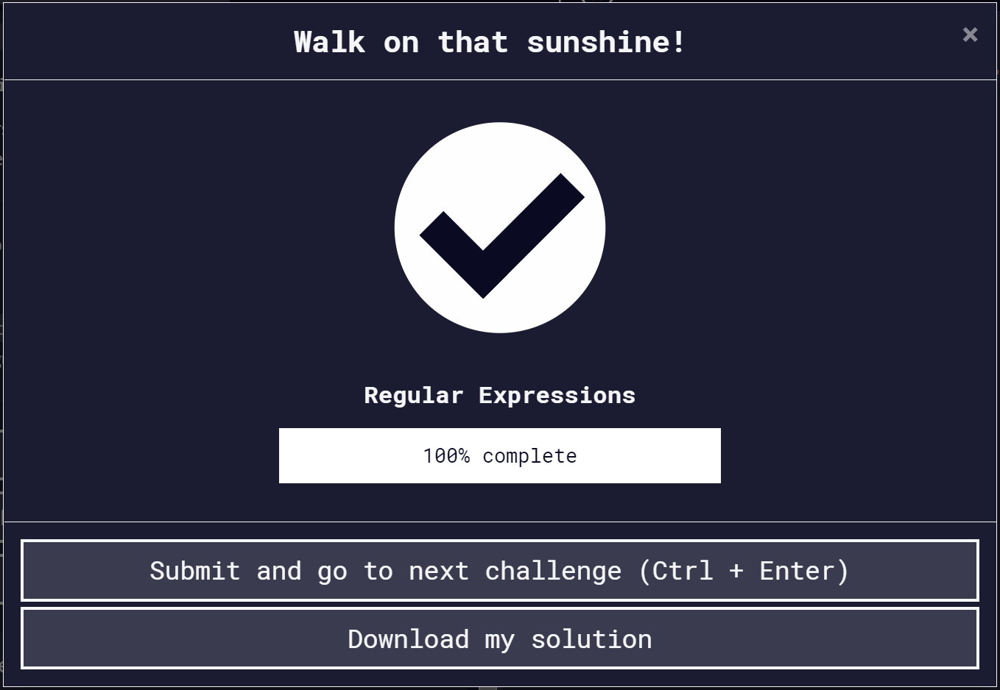

# JavaScript_Piscine

## Basic JavaScript:

| Command | Description |
| --- | --- |
| pop() | it remove a item at last |
| push() | it add a item at last |
| shift() | it remove a item at first |
| unshift() | it add a item at first |
| let | it define variable which is let just once define |
| const | it define variable which only read |
| object.var_name | it reach object items |
| object["var_name"] | it reach object items |
| parseInt(str) | it convert to int |
| Math.random() | it generate a random number between 0 and 1 |
| Math.floor() | it rounds the numbers|
| object.length | it turns object length |
| object.hasOwnProperty(prop) | it turn wheter object include prop |

## ES6:

## Regular Expressions:

## Debugging:

| Command | Description |
| --- | --- |
| console.log(variable) | it write on console from variable |
| console.clear() | clear console |
| typeof(variable) | it write on console type of variable |
| console.log('string ${variable}') | write variable in console with string |

